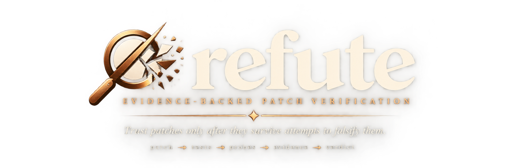
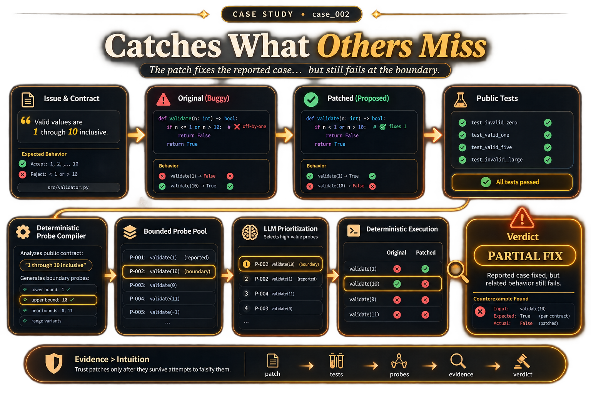
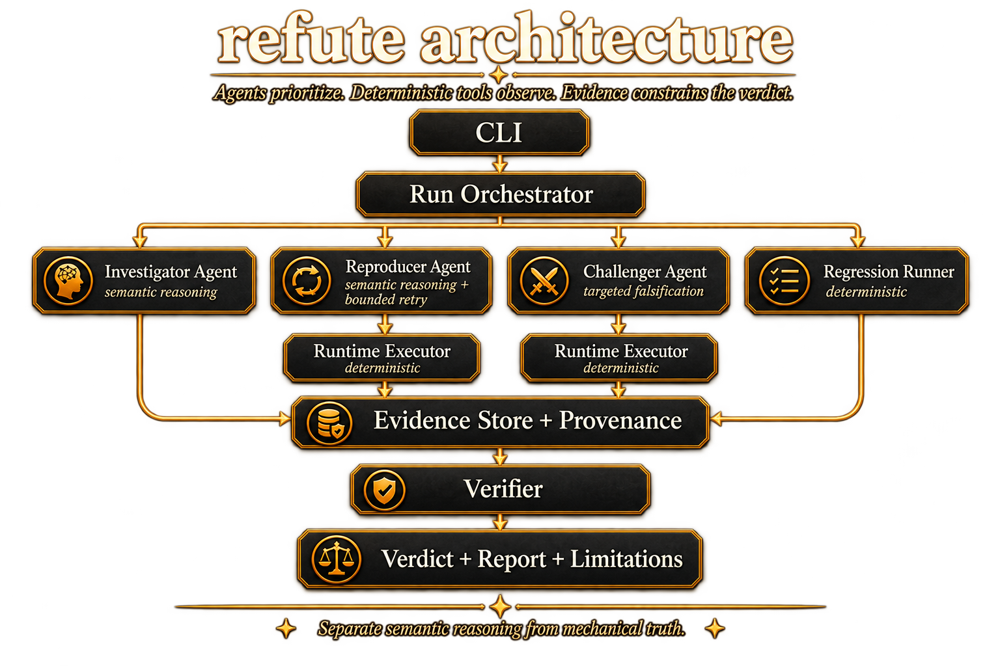
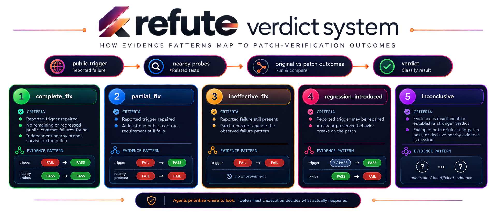
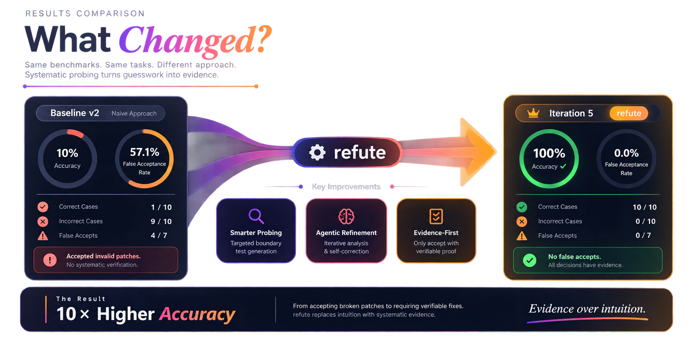
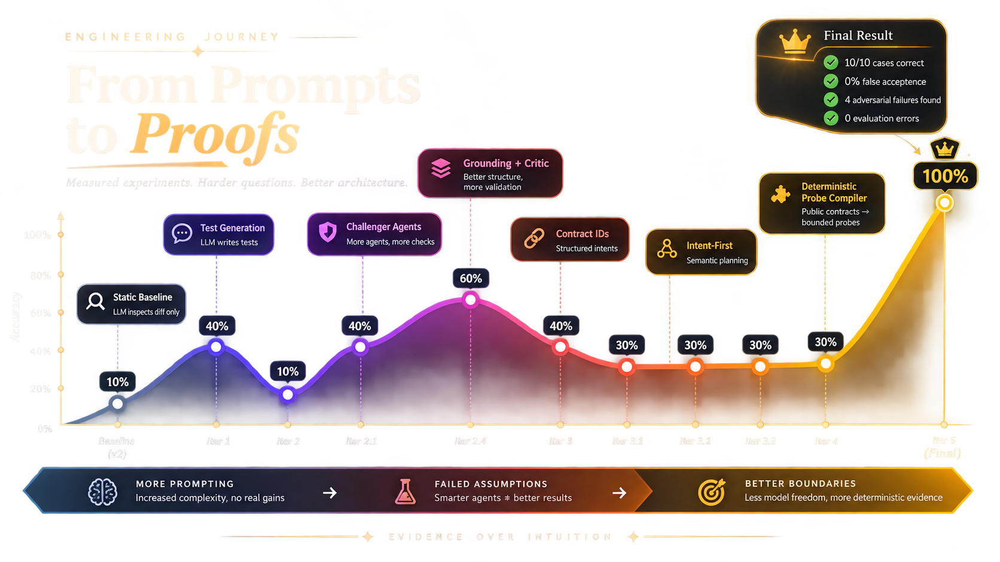

<div align="center">




**Frontier Engineering Challenge 2026**

[Why refute?](#why-refute) · [How it works](#how-it-works) · [Real PRs](#real-github-pr-workflow) · [Measured results](#measured-results) · [Quick start](#quick-start) · [MCP](#coding-agent-integration-mcp) · [Evidence](#evidence-and-reproducibility)

</div>

---

## Why refute?

Software patches are often reviewed by asking whether the diff *looks* correct. That is not the same as establishing that the bug is actually fixed.

A patch can repair the exact example from the issue while leaving an adjacent boundary broken, fix one behavior while regressing another, make a narrow test pass without satisfying the broader public contract, or simply look plausible to a language model without executable evidence.

`refute` takes a stricter approach:

> **Treat every proposed fix as a hypothesis, then actively try to falsify it.**

The system runs original and patched code, establishes whether the reported trigger is actually repaired, challenges nearby behavior, and returns a five-way verdict constrained by observed evidence.

### A concrete falsification

`case_002` is the simplest example: the patch repairs the lower boundary of an inclusive `0..100` contract, but still rejects `100`. The existing public test passes; refute derives and executes the missing upper-boundary probe and returns `partial_fix`.

<p align="center">
  
</p>

---

## How it works

The governing design rule is:

> **Agents prioritize. Deterministic tools observe. Evidence constrains the verdict.**

<p align="center">
  
</p>

The final Benchmark v2 architecture deliberately gives the model a narrow job. It does **not** author arbitrary pytest code or invent the final verdict. Mechanically recognizable public requirements are compiled into deterministic probes; the agent only prioritizes which valid probes to try first; deterministic execution decides what happened.

For compatible real GitHub PRs, refute adds a product-facing reproduction path: patch-authored changed pytest tests can be replayed against the base revision to establish the reported trigger, and a bounded nearby-test adversary can prioritize existing tests when the deterministic contract compiler has no matching vocabulary.

---

## Verdict model

| Verdict | Meaning |
|---|---|
| `complete_fix` | the reported trigger is repaired and enough independent nearby checks also survive |
| `partial_fix` | the reported trigger is repaired, but a closely related requirement still fails |
| `ineffective_fix` | the patch does not repair the observed failure |
| `regression_introduced` | the patch repairs the reported trigger but breaks behavior that worked before |
| `inconclusive` | the available evidence is insufficient for a stronger claim |

`inconclusive` is a first-class result. Refute prefers defensible uncertainty over fabricated certainty.

<p align="center">
  
</p>

---

## Real GitHub PR workflow

The dashboard's primary developer workflow accepts a **public GitHub pull-request URL** for a compatible Python/pytest repository.

```text
public GitHub PR
      ↓
inspect PR + public contract
      ↓
clone base/head revisions
      ↓
provision isolated per-run Python environment
      ↓
replay changed pytest tests on base + patch when available
      ↓
reported trigger repaired?
      ↓ yes
compile deterministic contract probes
      ↓ when unavailable
agent prioritizes bounded nearby existing tests
      ↓
deterministic execution
      ↓
evidence-backed verdict
```

A real run against `vitali87/pr-split#56` established a repaired trigger by replaying patch-authored tests against the base revision (`5 failed, 47 passed`) and patch (`52 passed`). The nearby adversary considered 40 existing candidates, selected three without fallback, and all three survived on both revisions. Refute therefore remained `inconclusive` rather than falsely claiming a complete fix.

That real-PR result is a product demonstration, **not** part of the frozen Benchmark v2 accuracy claim.

### Safety boundary

Dependency installation and repository tests execute third-party code locally. Refute creates an isolated per-run Python environment and requires explicit human acknowledgement before execution, but it is **not** a strong OS/container sandbox. Use only repositories you are willing to execute.

---

## Measured results

The hackathon evaluation uses **Benchmark v2**, a controlled ten-case benchmark with public case material separated from evaluator-only verdicts and hidden checks. All frozen measurements below use local Ollama with `qwen3:0.6b` at temperature `0`.

| System | Verdict accuracy | False acceptance rate | Avg runtime |
|---|---:|---:|---:|
| Static Baseline v2 | 10.0% | 57.1% | 2.527s |
| Test-first ablation 2.4 | 60.0% | 57.1% | 0.929s |
| Challenger 3 | 40.0% | 0.0% | 14.774s |
| Grounded Challenger 3.1 | 30.0% | 0.0% | 20.438s |
| Contract IDs 3.2 | 30.0% | 0.0% | 25.966s |
| Contract Critic 3.3 | 30.0% | 0.0% | 27.624s |
| Intent-first 4 | 30.0% | 0.0% | 13.026s |
| **Deterministic contract probes 5** | **100.0%** | **0.0%** | **5.077s** |

<p align="center">
  
</p>

### Frozen Iteration 5 result

- **10 / 10 correct verdicts**
- **0 evaluation errors**
- **0.0% false acceptance rate**
- **4 executable counterexamples discovered**
- **57.1% Challenger case yield**
- **0 challenge-generation failures**
- **0 planner fallbacks**
- **5.077s average runtime per case**

> **Important:** 100% is the measured result on this controlled ten-case Benchmark v2. It is not a claim of universal patch-verification accuracy.

---

## The experiment that mattered

The strongest improvement did **not** come from a better prompt.

Early iterations gave the model increasing responsibility: generating pytest source, grounding tests in issue text, selecting contract IDs, and using a separate Critic. Safety improved, but accuracy stalled around 30% and runtime increased. Iteration 4 removed Python generation but still asked the model to invent test semantics; accuracy remained 30%.

Iteration 5 changed the responsibility boundary:

```text
before
model invents test semantics + code
        ↓
execution tries to validate them

final
public contract
        ↓
deterministic probe compiler
        ↓
agent prioritizes valid probes
        ↓
deterministic execution
```

That structural change produced the first clean **10/10 Benchmark v2** result.

<p align="center">
  
</p>

See [`IMPROVEMENT_CHANGELOG.md`](IMPROVEMENT_CHANGELOG.md) for the measured iteration history.

---

## Benchmark integrity

Benchmark v1 exposed too much verdict information through public tests. A deterministic workflow reached 100% without meaningful agent participation, so that result was treated as a **benchmark failure**, not a success.

Benchmark v2 separates public inputs from evaluator-only scoring material:

```text
benchmark_v2/case_XXX/
  case.json          public metadata; no expected verdict
  issue.md           public bug contract
  original/
  patched/

eval/benchmark_v2/
  oracles.json       evaluator-only verdicts
  hidden_tests.json  evaluator-only nearby behavior
```

The Iteration 5 verification path does not load `oracles.json` or `hidden_tests.json`. Check the separation directly:

```powershell
python scripts/build_benchmark_v2.py
python scripts/audit_benchmark_v2.py
```

Expected integrity result:

```text
AUDIT PASSED: public cases are oracle-free and hidden behavior is separated as designed.
```

---

## Quick start

### Requirements

- Python 3.11+
- Ollama
- `qwen3:0.6b`
- Node/npm only for the dashboard frontend

### Install

```powershell
git clone https://github.com/ThunderKhan/refute.git
cd refute
python -m venv .venv
.venv\Scripts\Activate.ps1
python -m pip install -e ".[dev]"
ollama pull qwen3:0.6b
python scripts/build_benchmark_v2.py
python scripts/audit_benchmark_v2.py
python -m pytest
```

The frozen Iteration 5 measurement point recorded `72 passed in 63.16s`. After dashboard, real-PR, and MCP productization, the project suite was later locally verified as **92 passed in 67.48s**. The later test count does not alter the frozen benchmark metric.

### Verify the flagship benchmark case

```powershell
refute verify benchmark_v2\case_002 --provider ollama --model qwen3:0.6b --iteration 5 --llm-timeout 30
```

Representative result:

```text
original tests: FAIL
patched tests:  PASS
challenge outcome: remaining_requirement_counterexample
verdict: partial_fix
```

### Reproduce the final benchmark

```powershell
refute eval-advanced benchmark_v2 --oracle-root eval\benchmark_v2 --provider ollama --model qwen3:0.6b --iteration 5 --llm-timeout 30
```

For the exact clean-environment procedure and expected per-case verdicts, see [`REPRODUCTION_GUIDE.md`](REPRODUCTION_GUIDE.md).

### Run the dashboard

```powershell
python -m refute.dashboard_server
```

In another terminal:

```powershell
cd frontend
npm install
npm run dev
```

Open `http://localhost:5173/verify`.

---

## Coding-agent integration (MCP)

Refute exposes a local **stdio MCP server**, allowing coding-agent hosts to use the same verification engine without going through the dashboard.

The proven flow is:

```text
inspect_pr(url)
      ↓
human approves local execution
      ↓
verify_pr(..., confirm_execution=true) → job_id
      ↓
get_verify_job(job_id) until complete
      ↓
get_run(run_id)
```

`verify_pr` is asynchronous so long dependency/test runs do not depend on one MCP request remaining open.

Start the server with:

```powershell
python -m refute.mcp_server
```

or configure a compatible MCP host to launch:

```text
<python executable> -m refute.mcp_server
```

See [`docs/MCP_INTEGRATION.md`](docs/MCP_INTEGRATION.md) for OpenCode, Claude Code, Codex-style host guidance, MCP Inspector testing, and the explicit execution-approval contract.

---

## Evidence and reproducibility

Every advanced run persists evidence under:

```text
artifacts/runs/<run_id>/
```

Aggregate benchmark outputs are written to:

```text
artifacts/eval/advanced_iteration_5_benchmark_v2/
  summary.json
  cases.jsonl
  cases.partial.jsonl
  report.md
```

Development trajectories are preserved under [`traces/`](traces/). The final Iteration 5 package contains normalized observable actions, metadata, a summary, human instruction/checkpoint material, and the frozen local verification transcript. No hidden chain-of-thought is reconstructed.

---

## Scope

### Supported in the hackathon product

- controlled Python Benchmark v2 cases;
- public GitHub PR inspection;
- compatible public Python/pytest PR verification;
- isolated per-run Python dependency environment for target repositories;
- patch-authored changed-test reproduction against base and patch when available;
- deterministic public-contract probe compilation for a deliberately small contract vocabulary;
- bounded agent prioritization of valid probes or nearby existing tests;
- deterministic execution and evidence-backed five-way verdicts;
- local dashboard/API;
- local stdio MCP integration;
- local Ollama / provider abstraction.

### Not claimed

- arbitrary programming-language support;
- universal GitHub repository compatibility;
- formal correctness proofs;
- strong container/VM isolation for untrusted code;
- authoritative security review;
- automatic merging or deployment of patches;
- universal 100% patch-verification accuracy.

---

## Project structure

```text
src/refute/
  agents/                  agent roles + deterministic probe components
  benchmark/               evaluation and oracle-loading code
  cli.py                   command-line interface
  dashboard_server.py      local dashboard API
  github_pr.py             public PR inspection + workspace preparation
  real_repo_adversary.py   bounded nearby existing-test adversary
  mcp_server.py            stdio MCP tools + async verification jobs
  executor.py              deterministic command execution
  evidence/                persisted evidence records
  orchestrator.py          verification run state machine
  verify_v5.py             frozen Iteration 5 verifier

frontend/                  React/Vite developer dashboard
benchmark_v2/              generated oracle-free public benchmark cases
eval/benchmark_v2/         evaluator-only oracles + hidden checks
scripts/                   benchmark build + integrity audit
tests/                     unit and regression tests
traces/                    normalized development trajectories
docs/MCP_INTEGRATION.md    coding-agent integration guide
assets/                    README visual assets
```

---

## Documentation

| Document | Purpose |
|---|---|
| [`PROBLEM_STATEMENT.md`](PROBLEM_STATEMENT.md) | user problem and product thesis |
| [`PRD.md`](PRD.md) | product requirements and original design goals |
| [`MVP.md`](MVP.md) | supported scope, milestones, and acceptance criteria |
| [`ARCHITECTURE.md`](ARCHITECTURE.md) | verification architecture and component boundaries |
| [`IMPROVEMENT_CHANGELOG.md`](IMPROVEMENT_CHANGELOG.md) | measured experiments, regressions, and design decisions |
| [`TRAJECTORIES.md`](TRAJECTORIES.md) | human-readable index of coding-agent trajectories |
| [`REPRODUCTION_GUIDE.md`](REPRODUCTION_GUIDE.md) | frozen benchmark + current product reproduction procedure |
| [`docs/MCP_INTEGRATION.md`](docs/MCP_INTEGRATION.md) | MCP tools, safety contract, and host setup |
| [`traces/`](traces/) | normalized per-iteration execution/development evidence |

---

## Design principle

> **The breakthrough was not a better prompt. It was giving the model less responsibility.**

`refute` uses the language model where semantic prioritization is useful, deterministic code where truth is mechanically observable, and evidence as the boundary between the two.

---

## License

MIT
